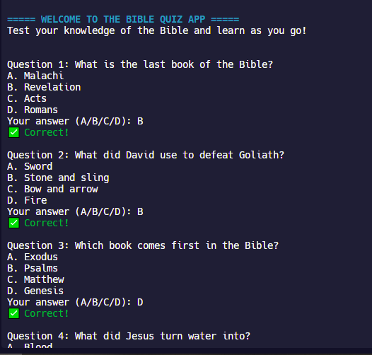

# 📖 Bible Quiz App (Python)

A fun and interactive command-line quiz game that tests your Bible knowledge through multiple choice questions. Built entirely in Python for learning and portfolio purposes.



---

## 🔹 Features

- 📚 10 randomized Bible trivia questions
- 🅰️ Multiple choice format (A/B/C/D)
- 🎨 Colored feedback for correct and incorrect answers using `colorama`
- 💯 Final performance summary (Excellent / Good Effort / Keep Practicing)
- 💾 Automatically saves quiz score history with date and time

---

## 🛠️ Technologies Used

- Python 3
- `colorama` for terminal text color
- Built-in modules: `random`, `datetime`

---

## ▶️ How to Run

1. Clone this repository or open in [Replit](https://replit.com)
2. Ensure `colorama` is installed:
   ```bash
   pip install colorama
4. Run main.py and follow the quiz prompts in the terminal
5. View saved results in score_history.txt

